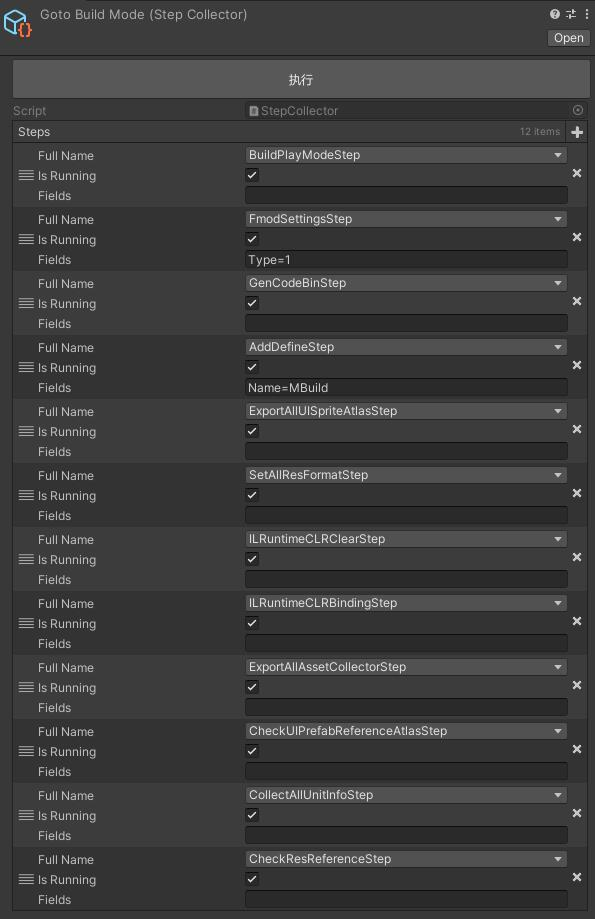
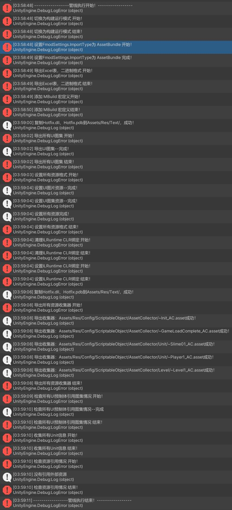

# 编辑器执行管线
## 需要其他插件：Odin（ https://github.com/TeamSirenix/odin-serializer ） CatJson（ https://github.com/CatImmortal/CatJson ）
## 特征：
1. 将任务分为各种步骤一个一个执行
2. 在执行过程中触发编译，也可在编译完成后继续自动执行剩下的步骤
3. 自定义步骤收集器，可以设置哪些要执行，也可以写在代码里
````csharp
var stepList = new List<IStep>();
stepList.Add(new BuildPlayModeStep());
stepList.Add(new FmodSettingsStep() { Type = ImportType.AssetBundle });
stepList.Add(new GenCodeBinStep());
stepList.Add(new AddDefineStep() { Name = "MBuild" });
stepList.Add(new ExportAllUISpriteAtlasStep());
stepList.Add(new SetAllResFormatStep());
stepList.Add(new ILRuntimeCLRClearStep());
stepList.Add(new ILRuntimeCLRBindingStep());
stepList.Add(new ExportAllAssetCollectorStep());
stepList.Add(new CheckUIPrefabReferenceAtlasStep());
stepList.Add(new CollectAllUnitInfoStep());
stepList.Add(new CheckResReferenceStep());
StepEditor.RunStepGroup(stepList);
````





